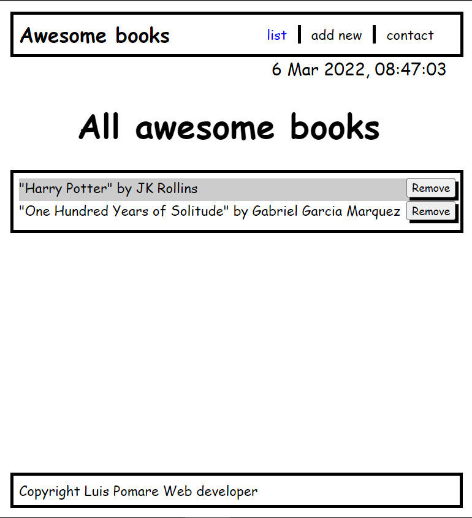

# Awesome books with ES6 sintax

> This is an improved version of the "awesome books" project. We have reorganized several functions in js modules, including the date/time luxon library to improve showing time functionality.

## Built With

- HTML, css and JS
- Luxon library
- Javascript modules

## Live Demo

[Live Demo Link](https://luis-pomare.github.io/awesomeBooksWithEs6/)

## Getting Started

You must to add your prefer books one by one. Go to the "add new" button and fill the inputs with title and author (respectively) and click the add button when the information is complete.

The most recent books is going to be shown in the top of the "list" page. The book list is being storaged in your local broweser so you don't have to concern in close the window.

### Install

If you want to run this repository on your local machine, you need to remember to install and use an extension like "live server" (from vscode), as this app contains JS modules that don't run locally without such extensions.

## Authors

👤 **Luis pomare**

- GitHub: [@luis-pomare](https://github.com/luis-pomare)
- Twitter: [@LuisPomare1](https://twitter.com/LuisPomare1)
- LinkedIn: [luis-pomare-388116225](https://www.linkedin.com/in/luis-pomare-388116225/)

## Show your support

Give a ⭐️ if you like this project!

## 📝 License

This project is [MIT](./MIT.md) licensed.
