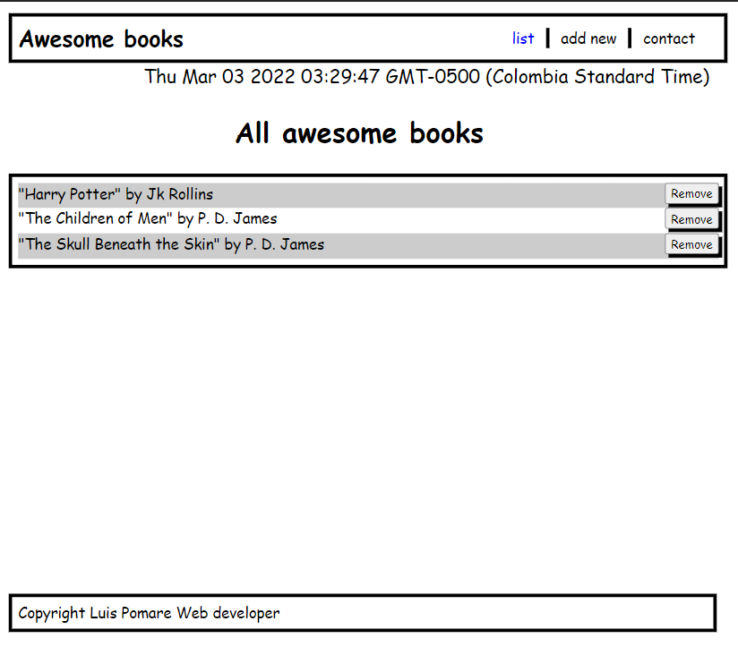

# Awesome books

> Simple application developed with javascrip. It's main function is to storage prefer books (just author and book name) in one page, allowing to the user to remove it by clicking a button. In this last updates, we have added some styles to make it more confortable to use as well as some functionalities that make it more dynamic.

## Built With

- HTML, css and Javascript.

## App screenshot

## Live version

https://luis-pomare.github.io/awesomeBooks/

## Getting Started

You must to add your prefer books one by one. Go to the "add new" button and fill the inputs with title and author (respectively) and click the add button when the information is complete.

The most recent books is going to be shown in the top of the "list" page. The book list is being storaged in your local broweser so you don't have to concern in close the window.

### Setup
- Click the green `Code` button on the repo
- In your local PC, open your terminal in the folder you would like to clone the project.
- Clone the repo with the command: `git clone (copied link)`; like so: `git clone https://github.com/luis-pomare/awesomeBooks`
- On the terminal, navigate into the directory like so: `cd awesomeBooks`

## Authors

👤 **Luis pomare**

- GitHub: [@luis-pomare](https://github.com/luis-pomare)
- Twitter: [@LuisPomare1](https://twitter.com/LuisPomare1)
- LinkedIn: [luis-pomare-388116225](https://www.linkedin.com/in/luis-pomare-388116225/)

👤 **Mark Rubanza**

- GitHub: [@Banzaman](https://github.com/banzaman)
- Twitter: [@banzamarq](https://twitter.com/banzamarq10)
- LinkedIn: [mark Rubanza Anderson](https://www.linkedin.com/in/mark-rubanza-anderson-4399a2211/)

## 🤝 Contributing

Contributions, issues, and feature requests are welcome!

Feel free to check the [issues page](https://github.com/luis-pomare/awesomeBooks/issues).

## Show your support

Give a ⭐️ if you like this project!

## 📝 License

This project is [MIT](./MIT.md) licensed.
